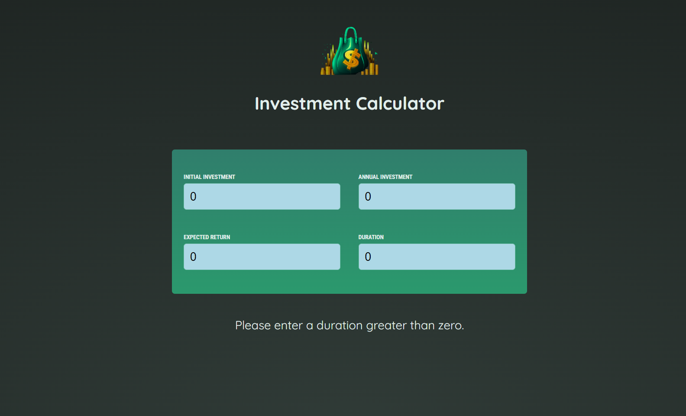
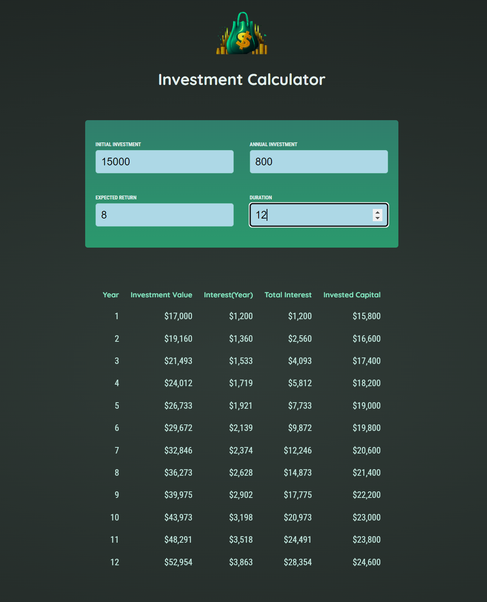

# Investment Calculator

Simple app to calculate how much money you would have accumulated given the initial investment, annual investment, expected interest return, and duration.

Check out the calculator here:
[Let's Calculate](https://simple-react-investment-calc.web.app/)

### Here's a picture of the initial input screen:



### Here's a picture of the results screen:



### Compiles and hot-reloads for development

```
npm run dev
```

## Built With

- [React](https://https://react.dev/)

## Contributing

Pull requests are welcome. For major changes, please open an issue first to discuss what you would like to change.

## License

[MIT](https://choosealicense.com/licenses/mit/)

## Author

Garrett Chun - [![Github][1.1]][1] [![Twitter][1.2]][2]

[1.1]: ./src/assets/githubCat.png
[1.2]: ./src/assets/twitter20.png
[1]: https://github.com/KapakahiCoder
[2]: http://www.twitter.com/KapakahiCoder
